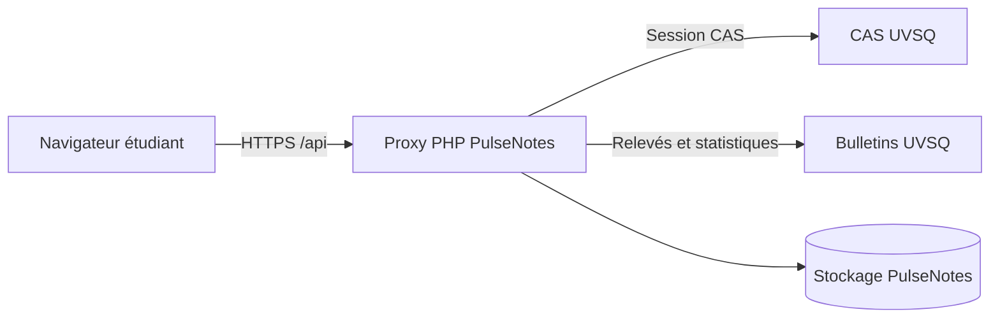
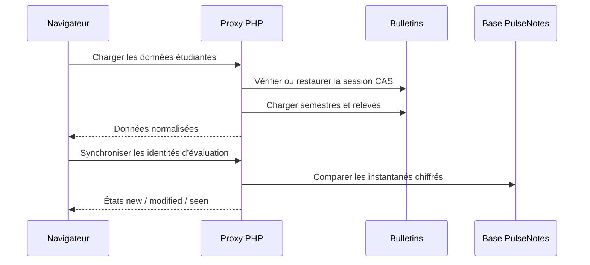

# Architecture

## Vue générale

Le frontend n’appelle jamais directement CAS ou Bulletins. Le proxy valide les routes distantes, maintient la session, normalise les erreurs et limite les données persistées.

## Composants

### Frontend

Application React construite avec Vite. Elle gère l’affichage, les périodes, les filtres, les graphiques et la génération locale des bulletins PulseNotes.

### Proxy PHP

Le routeur `php/router.php` gère :

- l’authentification et la restauration CAS ;
- les requêtes autorisées vers Bulletins ;
- le cache court des distributions ;
- l’état `new`, `modified` ou `seen` des évaluations ;
- les sessions et les liens publics des installations personnelles ;
- le téléchargement des documents officiels.
- la route courte `/install.sh` du service global, qui relaie l’installateur personnel.

### Stockage

| Mode | Stockage | Particularité |
| --- | --- | --- |
| `global` | MySQL ou PostgreSQL | Utilisateurs multiples et sessions partagées |
| `selfhosted` | SQLite | Un compte et secret CAS chiffré localement |

Les points d’entrée de `deploy/global/` et `deploy/personal/` imposent le mode. Le cœur métier reste commun.

## Chargement des données

Les distributions complètes sont chargées seulement lorsqu’une note devient visible. Cette stratégie évite une requête `listeNotes` pour toutes les évaluations au démarrage.

## Dépendances externes

- CAS UVSQ pour l’authentification ;
- Bulletins UVSQ et sa passerelle ScoDoc pour les relevés et distributions ;
- aucune API externe pour générer les PDF PulseNotes.

Une panne distante doit produire un état explicite et récupérable, jamais une valeur calculée ou un zéro de remplacement.
