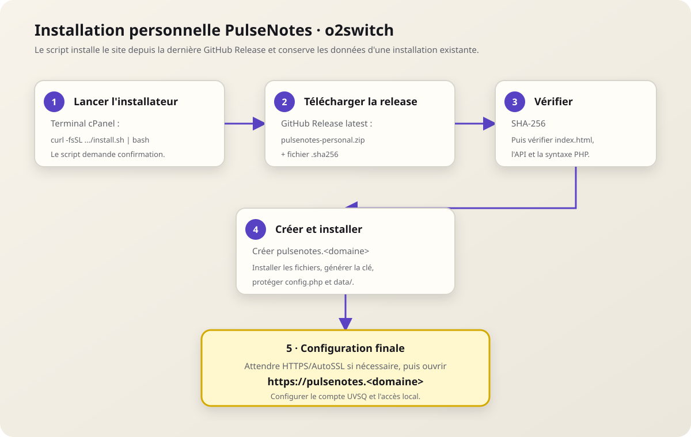

# Installation

PulseNotes existe en deux éditions. Choisissez l’édition avant de préparer l’hébergement.

## Choisir une édition

| | Globale | Personnelle |
| --- | --- | --- |
| Utilisateurs | Plusieurs | Un seul |
| Base de données | MySQL ou PostgreSQL | SQLite |
| Connexion | Identifiants UVSQ à chaque nouvelle session | PIN, schéma ou mot de passe local après configuration |
| Mot de passe UVSQ | Jamais stocké | Chiffré sur l’installation privée |
| Hébergement visé | Serveur administré | Hébergement personnel, notamment o2switch |

## Construire les paquets

Depuis Windows :

```bat
build-release.bat
```

Le script crée :

- `output/pulsenotes-global.zip` ;
- `output/pulsenotes-personal.zip` ;
- un fichier `.sha256` pour chaque archive ;
- `output/install-personal-o2switch.sh`.

## Installation personnelle sur o2switch



L’installateur cible le Terminal cPanel. Il récupère la dernière archive de la GitHub Release, vérifie son empreinte SHA-256, crée le sous-domaine `pulsenotes`, installe les fichiers, génère la clé applicative et protège SQLite. S’il existe déjà une installation, `api/config.php` et `api/data/` sont conservés.

Avant l’installation, activez l’extension PHP **imagick** dans cPanel (Select PHP Version > Extensions). Elle est nécessaire pour convertir les cartes de partage en PNG 1200 × 630. Vérifiez ensuite dans le Terminal :

```bash
php -m | grep -i '^imagick$'
```

La commande doit afficher `imagick`. L’extension doit aussi être activée pour la version PHP utilisée par le domaine, pas uniquement pour le PHP CLI.

Depuis le Terminal cPanel, vous pouvez le télécharger depuis le service global :

```bash
curl -fsSL https://pulsenotes.mmi.place/install.sh | bash
```

Cette route courte relaie l’installateur publié dans la dernière GitHub Release. Vérifiez le script avant exécution si votre politique d’exploitation l’exige.

L’URL de téléchargement par défaut peut être remplacée :

```bash
PULSENOTES_RELEASE_URL="https://example.org/pulsenotes-personal.zip" \
PULSENOTES_RELEASE_HASH_URL="https://example.org/pulsenotes-personal.zip.sha256" \
  bash install-personal-o2switch.sh
```

À la fin, le script affiche un encadré jaune avec l’adresse du site. Si AutoSSL n’a pas encore activé HTTPS, attendez sa propagation puis ouvrez cette adresse. L’assistant vérifie le compte UVSQ, puis permet de choisir un PIN, un schéma ou un mot de passe local.

### Mise à jour personnelle

Le paquet personnel contient `api/update.sh`. Le script télécharge la dernière Release GitHub et préserve `api/config.php` ainsi que `api/data/`, qui contient la base SQLite.

Avant une mise à jour :

1. sauvegarder le dossier de l’installation ;
2. vérifier l’URL et l’empreinte de la nouvelle archive ;
3. exécuter l’updater depuis le compte d’hébergement ;
4. contrôler `/api/status` et ouvrir l’application.

## Installation globale

Le service global public prévu pour PulseNotes est : <https://pulsenotes.mmi.place>.

Prérequis serveur :

- PHP 8.1 ou supérieur avec `curl`, `dom`, `libxml`, `session` et le pilote PDO de la base ;
- PHP 8.1 ou supérieur avec `imagick` pour les images PNG de partage ;
- MySQL ou PostgreSQL ;
- HTTPS obligatoire ;
- accès sortant à CAS et à Bulletins UVSQ.

Procédure :

1. extraire `pulsenotes-global.zip` dans la racine web ;
2. ouvrir le fichier `api/config.php` déjà présent ;
3. remplacer toutes les valeurs `CHANGEZ_…` et créer une clé aléatoire d’au moins 32 octets ;
4. renseigner le DSN et le compte de base de données ;
5. protéger `api/config.php` en lecture serveur uniquement ;
6. ouvrir `/api/status`, puis tester une connexion complète.

Exemple :

```php
<?php
return [
    'PULSENOTES_INSTANCE_NAME' => 'PulseNotes',
    'PULSENOTES_APP_KEY' => 'UNE_CLE_ALEATOIRE_LONGUE_ET_UNIQUE',
    'PULSENOTES_DATABASE_DSN' => 'mysql:host=localhost;dbname=pulsenotes;charset=utf8mb4',
    'PULSENOTES_DATABASE_USER' => 'pulsenotes',
    'PULSENOTES_DATABASE_PASSWORD' => 'SECRET_BASE_DE_DONNEES',
];
```

Ne placez jamais ce fichier dans Git. Conservez la clé applicative séparément des sauvegardes de base de données.

### Clé applicative

`PULSENOTES_APP_KEY` est la clé maîtresse de l’installation. Elle protège les sessions, les instantanés de notes et, en installation personnelle, les partages enregistrés. Générez-la une seule fois :

```bash
openssl rand -hex 32
```

Elle doit rester secrète, stable et différente entre deux installations. La perdre rend les données chiffrées illisibles ; la modifier sans migration invalide les sessions et les enregistrements existants.

### Mise à jour globale

Le paquet global contient aussi `api/update.sh`. Il remplace le frontend et le code PHP, mais conserve `api/config.php` et ne touche pas à la base distante.

```bash
cd /chemin/du/site/api
./update.sh
```

Le domaine n’est pas configuré dans l’updater : le dossier cible est déterminé par l’emplacement du script. Exécuter `/home/compte/pulsenotes/api/update.sh` met donc à jour l’application servie par le domaine dont la racine pointe vers `/home/compte/pulsenotes`.

Pour utiliser un serveur de versions différent :

```bash
PULSENOTES_RELEASE_URL="https://releases.example.org/pulsenotes-global.zip" ./update.sh
```

Une automatisation facultative peut être ajoutée dans cPanel avec une tâche cron quotidienne :

```cron
17 4 * * * /home/COMPTE/pulsenotes/api/update.sh >> /home/COMPTE/logs/pulsenotes-update.log 2>&1
```

Une mise à jour manuelle après sauvegarde reste plus prudente. L’empreinte SHA-256 vérifie le téléchargement, mais ne remplace pas une signature cryptographique indépendante du serveur de publication.

## Vérification après installation

- `/api/status` répond en JSON et annonce le bon mode ;
- l’application est servie uniquement en HTTPS ;
- une connexion de test charge les semestres ;
- une déconnexion invalide la session ;
- les fichiers `api/config.php` et `api/data/` ne sont pas téléchargeables ;
- les sauvegardes et la purge des données dormantes sont planifiées.
